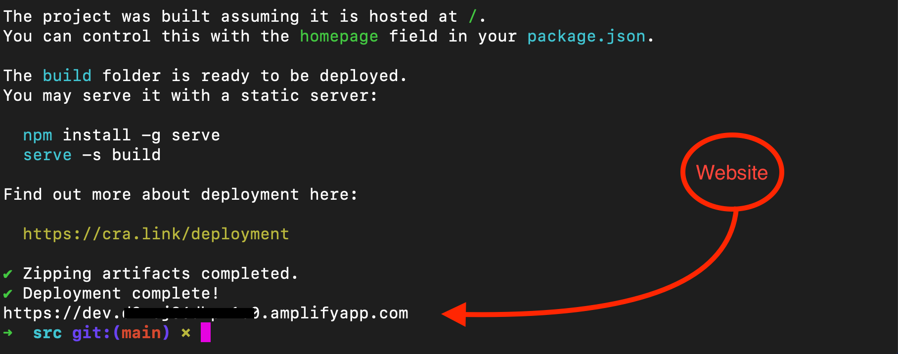

## **_Building a Fintech App on AWS Using the Plaid API_**

### Overview

Hello and welcome! My name is Cecilia, and in this amazing project, I will demonstrate how to build and deploy a demo fintech app on Amazon Web Services (AWS) using the using the [AWS Amplify](https://aws.amazon.com/amplify/) framework and [Plaid](https://plaid.com/docs/link/) link API (application programming interface). 


AWS Amplify will enable us to quickly build a serverless web app with the following components:
- [React](https://reactjs.org/) (for front-end interface)
- [Amazon Cognito](https://aws.amazon.com/cognito/) (for user sign-up/sign-in)
- [Amazon API Gateway](https://aws.amazon.com/api-gateway/)-based REST API
- [Amazon DynamoDB](https://aws.amazon.com/dynamodb/)

Plaid is a financial services company and that helps fintech providers connect users securely to their bank accounts. In other words, it acts as a secure proxy between a fintech app and a bank. Plaid has connected over 12,000 banks and financial institutions throughout the world.using a single API! Today over 5,500 fintech apps use Plaid’s API to enable their users to access their bank accounts.

Fintech apps like Plaid offer a wide range of finance and banking interactions to users. This includes anything from payments to lending to trading. The concept of _Open Finance_ has been growing in popularity across the world. As the name suggests, "Open Finance" is a data-sharing model that refers to greater access to customer data through fintech apps (third-party apps). This include such as mortgages, savings accounts, retirement accounts, bills, payroll data, and more.

Fintech apps enhance the customer experience like never before. All that users need to do is simply link the app to their bank and/or brokerage accounts, and grant the necessary permissions. Due to the nature of fintech apps, they provide enhanced security features, such as multi-factor authentication and proof of identity.

The benefits of using Fintech apps include: making online payments for products using a “Buy Now Pay Later” plan, outlining monthly income and expense categories for budgeting, investing in crypto-assets, and more!

### Architectural Diagram

Here is an architectural diagram that summarizes the services and tools that are involved. This is a completely scalable and secure architecture which does not require the user to manage any server instances:


------------------------------------------------------------
### Pre-requisites

Before we begin, it is imperative that we have the software and tools installed, setup, and ready-to-go!

- Ensure that you have created a sandbox account at Plaid, and obtained your API keys. To achieve this, visit the [Plaid website](https://www.plaid.com) and then click `Get API Keys`.


- On the signup page, fill out your information, then select `create account`.


- Next, install [AWS Amplify](https://docs.amplify.aws/cli/start/install/) on your local PC.

- Lastly, create [AWS configuration](https://docs.aws.amazon.com/cli/latest/userguide/cli-configure-quickstart.html#cli-configure-quickstart-config) profile by running the following command on your Terminal:

```
$ aws configure
```
- Be sure to enter the corresponding information when prompted:


------------------------------------------------------------
### Getting Started

Now the fun begins!

- Begin by running the following commands to clone the Plaid demo app from Github:

```bash
$ git clone https://github.com/aws-samples/aws-plaid-demo-app.git 
$ cd aws-plaid-demo-app
```


- Next, begin the installation using the following command:

```
$ npm install
```


**TROUBLESHOOTING**: If you do not have the `npm` command in your local pc, install Node JS (npm will be installed with Node):

```
$ brew install node
```

- Next, initialize a new Amplify project. When prompted, press `Enter/Return` on your keyboard, to accept the default.

```bash
$ amplify init
```


- Next, you will be prompted with a series of questions. Provide the following answers for each prompt:


? Enter a name for the project `awsplaiddemoapp`

? Initialize the project with the above configuration? (Y/n) `Y`

? Select the authentication profile you want to use: (Use arrow keys) `AWS profile` 

? Please choose the profile you want to use: (Use arrow keys) `default`

_Your project has been successfully initialized and connected to the cloud!_

- **Add authentication**

```bash
$ amplify add auth 
```

? Do you want to use the default authentication configuration? `Default configuration`

? How do you want users to be able to sign in? (Use arrow keys and space bar to select) `Username`

? Do you want to configure advanced settings? `No, I am done`


- **Add the API**

```
$ amplify add api
```

? Please select from one of the below mentioned services: `REST`

? Provide a friendly name for your resource to be used as a label for this category in the project: `plaidtestapi`

? Provide a path (e.g., /book/{isbn}): `/v1`

? Choose a Lambda source: `Create a new Lambda function`

? Provide an AWS Lambda function name: `plaidaws`

? Choose the runtime that you want to use: `NodeJS`

? Choose the function template that you want to use: `Serverless ExpressJS function (Integration with API Gateway)`

? Do you want to configure advanced settings? `Yes`

? Do you want to access other resources in this project from your Lambda function? `No`

? Do you want to invoke this function on a recurring schedule? `No`

? Do you want to enable Lambda layers for this function? `No`

? Do you want to configure environment variables for this function? `Yes`

? Enter the environment variable name: `CLIENT_ID`

? Enter the environment variable value: `[Enter your Plaid client ID]`

- The `Plaid client ID` can be located on the Plaid website. Navigate to your account dashboard and click `Team Settings` on the menu bar. In the drop down menu, click `Keys`.


- On the next page, locate the CLIENT_ID.


? Select what you want to do with environment variables: `Add new environment variable`

? Select the environment variable name: `TABLE_NAME`

? Enter the environment variable value: `plaidawsdb`

? Select what you want to do with environment variables: `I am done`

? Do you want to configure secret values this function can access? `Yes`

? Enter a secret name (this is the key used to look up the secret value): `PLAID_SECRET`

? Enter the value for PLAID_SECRET: `[Enter your Plaid sandbox API key - hidden]`

? What do you want to do? `I'm done`

? Do you want to edit the local lambda function now? `No`

? Restrict API access: `No`

? Do you want to add another path? `No`

- Copy the Lambda source file and install dependencies, using the following commands:

```bash
$ cp lambda/plaidaws/app.js amplify/backend/function/plaidaws/src/app.js
$ cd amplify/backend/function/plaidaws/src
$ npm i aws-sdk moment plaid@8.5.4
```


- Lastly, push using the following command:

```
$ amplify push
```
? Are you sure you want to continue? `Yes`


- Next, add a database:

```bash
$ amplify add storage
```

? Please select from one of the below mentioned services: `NoSQL Database`

? Please provide a friendly name for your resource that will be used to label this category in the project: `plaidtestdb`

? Please provide table name: `plaidawsdb`

- At this point, you can now add columns to the table!


? What would you like to name this column: `id`

? Please choose the data type: `string`

? Would you like to add another column? `Yes`

? What would you like to name this column: `token`

? Please choose the data type: `string`

? Would you like to add another column? `No`

? Please choose partition key for the table: `id`

? Do you want to add a sort key to your table? `No`

? Do you want to add global secondary indexes to your table? `No`

? Do you want to add a Lambda Trigger for your Table? `No`

- Great job! You have successfully added resource plaidtestdb locally!


- Next, update the Lambda function to add permissions for the database:

```bash
$ amplify update function
```

? Select the Lambda function you want to update `plaidaws`


? Which setting do you want to update? `Resource access permissions`

? Select the categories you want this function to have access to: `storage`

? Storage has 2 resources in this project. Select the one you would like your Lambda to access: `plaidawsdb`

? Select the operations you want to permit on plaidawsdb: `create, read, update, delete`

? Do you want to edit the local lambda function now? `No`

### Deploying the App

- Add hosting for the app:

```bash
$ amplify add hosting
```

? Select the plugin module to execute: `Hosting with Amplify Console (Managed host
ing with custom domains, Continuous deployment)`

? Choose a type: `Manual deployment`


- Deploy the app:

```
$ amplify publish
```

? Are you sure you want to continue? (Y/n) `Y`

_Please be patient, this may take a few minutes!_


### Testing the App

Let's test our newly created app! 

- Begin by navigating to the website URL that was displayed by the *amplify publish* command, and sign up as a new user. 




- Alternatively, you can find the website URL on the AWS Amplify service of the AWS management console. 


- After clicking on the website URL, create a new an account. Enter a username, password, email address and phone number. Be sure to check your email for the OTC (one time code) to verify your account.


- Next, after you sign in, click `Connect with Plaid`.


- Next, click `continue`


- Select a bank from the list provided


 - Next, use the following credentials to access the bank and display the transactions:

**username:** `user_good`
**password:** `pass_good`


- After you have entered your credentials, you should see a `success` page! Click `continue` to access the bank and display the transactions.

 

----------------------------------------------------------------------
## Clean Up 

Nice work! Now we will begin the clean up process, so that we can prevent charges from prolonged usage of our resources.

- Navigate to the AWS Amplify service of the AWS management console to delete the demo app. 


- When prompted, confirm that you want to delete the app:


- It will take a few minutes for the app to delete. Please be patient!


- The app will be deleted! 


----------------------------------------------------------------------

Wonderful job! Thank you for viewing my project and following along. We learned how to use AWS Amplify to create a secure, scalable, and completely serverless fintech app on AWS. I hope you enjoyed it! For more details on similar projects and more, please visit my GitHub portfolio: https://github.com/ceciliacloud


